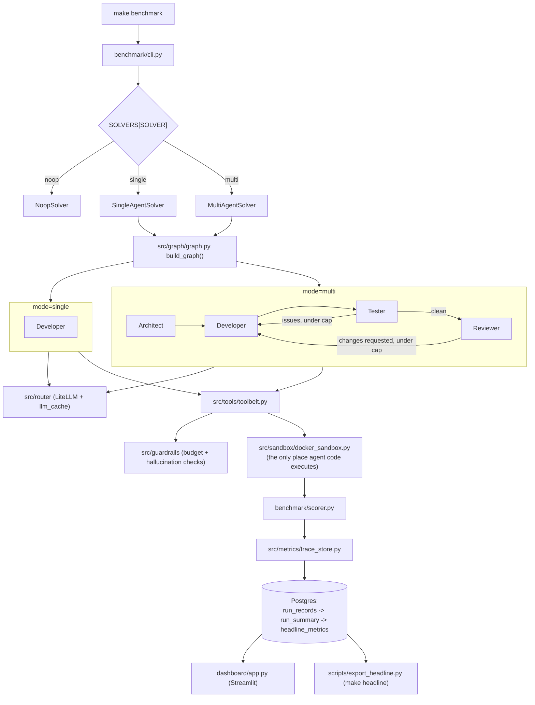

# Multi-Agent SWE Benchmark

A controlled study of when multi-agent coding pays off: four LangGraph agents (Architect,
Developer, Tester, Reviewer) vs. a single agent, both resolving the same [SWE-bench](https://www.swebench.com/)
issues, scored and compared head-to-head.

## Headline result

Generated by `make headline`, which reads the most recent `single` and `multi` runs straight out
of Postgres — this table is never hand-typed.

| Solver | Run ID   | Total tasks | Success rate (%) | Mean cost / solved ($) | p50 latency (s) | p99 latency (s) | Hallucination rate | Mean iterations |
|:-------|:---------|------------:|------------------:|------------------------:|------------------:|------------------:|--------------------:|------------------:|
| single | 132b99e1 |           7 |              28.57 |               5.521e-05 |              0.001 |              3.556 |                    0 |               0.86 |
| multi  | 07667bb4 |           7 |              28.57 |               1.535e-05 |              0.001 |              3.566 |                    0 |               0.86 |

Run on 2026-08-04, `TASKS=lite-5` (the 5 versioned SWE-bench Lite instance IDs in
`config/tasks/lite-5.txt` plus the 2 in-repo custom tickets the loader always includes — 7 tasks
total). Strong tier: `openrouter/qwen/qwen-2.5-72b-instruct`. Small tier:
`groq/llama-3.1-8b-instant`.

**Read this table carefully — two things are not what they look like:**

1. **Only 2 of the 7 tasks can pass by design**, and the same 2 pass in both rows. The 5 real
   SWE-bench instances (`astropy__astropy-12907`, `django__django-*`) FAIL immediately: the task
   loader (Spec 03) only resolves instance IDs, not the actual repo checkout, so
   `SingleAgentSolver`/`MultiAgentSolver` short-circuit to an empty patch for any non-custom task
   (`benchmark/solver.py:128`), and `sb-cli` scoring is unavailable without a `SWEBENCH_API_KEY`.
   This is a known, documented non-goal of Spec 03, not a bug introduced here — but it means the
   28.57% figure is really **2/2 on the only 2 solvable tasks**, not a meaningful SWE-bench Lite
   pass rate. See [`WRITEUP.md`](WRITEUP.md) for what that implies about this headline.
2. **The multi row's cost looks *lower* than single's — that's the response cache, not the system
   being cheaper.** A first `multi` run (run `821c670b`, cold cache) cost $0.00050018 total
   ($0.00025009 mean/solved) — **4.5× single's cost**, the expected direction. The `07667bb4` run
   shown above is a *second* `multi` run made minutes later against the same 2 deterministic
   tasks, so `src/router`'s response cache (Spec 01) served most of its calls for free. Both are
   real numbers from real runs; neither is wrong, but only the cold-cache run is representative of
   what a fresh multi-agent task actually costs. Full breakdown in `WRITEUP.md`.

To reproduce or refresh this table:
```bash
make setup
make benchmark TASKS=lite-5 SOLVER=single
make benchmark TASKS=lite-5 SOLVER=multi
make headline
```

The answer in one sentence lives in [`WRITEUP.md`](WRITEUP.md).

## Architecture



Every path that runs agent-generated code funnels through `src/sandbox/docker_sandbox.py` — no
generated code ever runs on the host. This is enforced by a `block-host-exec` pre-tool hook during
development and is a hard rule for this repo (see `CLAUDE.md`).

## Quickstart

Prerequisites: Python >= 3.11, a running Docker daemon, and API keys for at least one LLM provider.

```bash
git clone <this-repo>
cd 2_SWE_Agent
cp .env.example .env    # fill in DATABASE_URL, OPENROUTER_API_KEY, GROQ_API_KEY, etc.
make setup               # venv + deps, Postgres, schema, sandbox image
make benchmark TASKS=lite-5 SOLVER=multi
make dashboard            # Streamlit on http://localhost:8501
```

`make setup` is `setup-python` (venv + `pip install -e ".[dev]"`, no Docker needed — this is what
CI runs) followed by `setup-infra` (Postgres + schema + sandbox image build, needs Docker).

**If port 5432 or `DATABASE_URL`/`LITELLM_CONFIG` are already set in your shell** (e.g. a local
Homebrew/native Postgres already listening on 5432, or an inherited dev-environment default), the
Makefile's `?=` won't override an already-exported variable, and `make setup-infra` will hang
waiting for a Postgres that never becomes reachable at the wrong port. Set `POSTGRES_PORT` in
`.env` to a free port and match it in `DATABASE_URL`, and pass `DATABASE_URL=...` explicitly on
the `make` command line if your shell already exports one — `make benchmark ... DATABASE_URL=...`
always wins over both the Makefile default and an inherited shell value.

## Reproducing the headline

```bash
make setup
make benchmark TASKS=lite-5 SOLVER=single
make benchmark TASKS=lite-5 SOLVER=multi
make headline
```

**Tolerance:** on a 5-task subset at temperature > 0, a single task flipping outcome moves the
pass rate by 20 percentage points — treat the headline as accurate to **±1 task**, not a tighter
percentage. In the two `multi` runs actually observed (2026-08-04), the pass rate itself did not
move (28.57% both times, i.e. 2/2 on the tasks capable of passing at all — see the headline
section's caveats), but **total cost moved 16×** between the two runs (a cold-cache run vs. a
warm-cache repeat) — that is the spread worth caring about here, and it is a caching artifact, not
stochastic task-outcome variance. See `WRITEUP.md` for the breakdown. `TASKS=lite-30` gives a
materially more defensible headline at higher cost/time, and is the recommended upgrade if budget
allows — it would also give the 5 real SWE-bench instances more chances to include at least one the
current loader/scorer limitation doesn't block.

## Environment the results were produced on

| | |
|---|---|
| OS | macOS-26.5.2-arm64-arm-64bit-Mach-O |
| Python | 3.13.3 |
| Docker | 29.6.1 (build 8900f1d) |
| Strong tier | `openrouter/qwen/qwen-2.5-72b-instruct` |
| Small tier | `groq/llama-3.1-8b-instant` |
| Task subset | `lite-5` (5 SWE-bench instance IDs + 2 custom tickets, 7 tasks) |
| Date | 2026-08-04 |

Regenerated by `make headline` into `reports/headline_env.md` alongside `reports/headline.md`.

## Demo video

_Placeholder — a 90-second recording following `scripts/demo_shotlist.md` will be linked here._

## Repo layout

```
src/
  agents/          LangGraph agent node definitions (Architect, Developer, Tester, Reviewer)
  tools/           tool wrappers available to agents (toolbelt, run-code MCP server)
  router/          LiteLLM router setup + response cache
  guardrails/      budget cap + hallucination checks
  sandbox/         the sole choke-point for executing agent-generated code (docker_sandbox.py)
  metrics/         trace storage, aggregation, hallucination scoring
  graph/           the LangGraph state machine (single vs. multi mode)
benchmark/         CLI entry point, task loader, solver interface, scorer, results writer
config/
  litellm_config.yaml   model tier + role assignment
  docker/                Dockerfile + compose for Postgres and the sandbox image
  tasks/                 SWE-bench task subsets (lite-5, lite-30, custom)
specs/             spec-driven development docs (spec.md / plan.md / tasks.md per phase)
tests/
  unit/            no external services
  integration/     skips automatically unless Docker/Postgres are reachable
dashboard/         Streamlit app + the DB-read and formatting layers it's built on
scripts/           sandbox_exec.py, db_init.sql, export_headline.py, demo_shotlist.md
reports/           generated output (headline.md, headline_env.md) — never hand-edited
```

## Make targets

```bash
make setup          # setup-python + setup-infra
make setup-python    # venv + deps only, no Docker (what CI runs)
make setup-infra     # Postgres + schema + sandbox image, needs Docker
make lint            # ruff check + black --check
make test             # pytest tests/unit + tests/integration (integration auto-skips without infra)
make benchmark        # TASKS=lite-5 SOLVER=multi by default; override either
make headline          # regenerate reports/headline.md from Postgres
make sandbox-run      # execute a script/command inside the Docker sandbox
make dashboard        # Streamlit on :8501
make db-shell          # psql into benchmark_db
make clean             # stop containers, drop volumes, clear caches/logs/reports
```

## Sandbox safety rule

Generated/untrusted code runs **only** inside the Docker sandbox, never on the host. See
`CLAUDE.md` for the full rule and its enforcement.

## Further reading

- [`WRITEUP.md`](WRITEUP.md) — the measured result, cost/latency tradeoffs, and where the extra
  agents helped or didn't.
- `progress_report.md` — the full sequence-by-sequence build history (What/Why/How/Issues per
  spec).
- `specs/` — the spec-driven development trail (spec.md/plan.md/tasks.md per phase).
