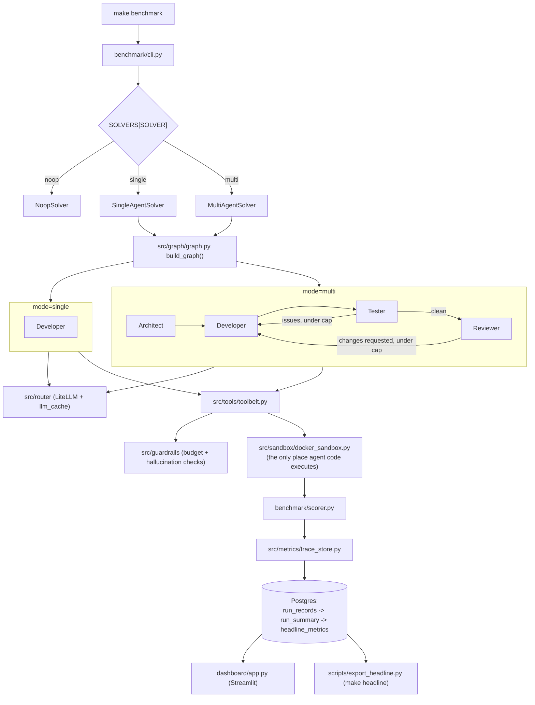

# Multi-Agent SWE Benchmark

A controlled study of when multi-agent coding pays off: four LangGraph agents (Architect,
Developer, Tester, Reviewer) vs. a single agent, both resolving the same [SWE-bench](https://www.swebench.com/)
issues, scored and compared head-to-head.

## Headline result

> **Not yet generated.** The headline table below is produced by `make headline`, which reads the
> most recent `single` and `multi` runs out of Postgres — it is never hand-typed, so it cannot
> drift from what actually ran. No benchmark run has been executed in this project's history yet
> (Docker has not been available in any session so far; see `progress_report.md` Sequence 14).
>
> To fill this section in: start Docker Desktop, then run
> ```bash
> make setup
> make benchmark TASKS=lite-5 SOLVER=single
> make benchmark TASKS=lite-5 SOLVER=multi
> make headline
> ```
> and paste the contents of `reports/headline.md` here, with a caption naming the run IDs, task
> subset, models, and date.

The answer in one sentence, once measured, lives in [`WRITEUP.md`](WRITEUP.md).

## Architecture



Every path that runs agent-generated code funnels through `src/sandbox/docker_sandbox.py` — no
generated code ever runs on the host. This is enforced by a `block-host-exec` pre-tool hook during
development and is a hard rule for this repo (see `CLAUDE.md`).

## Quickstart

Prerequisites: Python >= 3.11, a running Docker daemon, and API keys for at least one LLM provider.

```bash
git clone <this-repo>
cd 2_SWE_Agent
cp .env.example .env    # fill in DATABASE_URL, OPENROUTER_API_KEY, GROQ_API_KEY, etc.
make setup               # venv + deps, Postgres, schema, sandbox image
make benchmark TASKS=lite-5 SOLVER=multi
make dashboard            # Streamlit on http://localhost:8501
```

`make setup` is `setup-python` (venv + `pip install -e ".[dev]"`, no Docker needed — this is what
CI runs) followed by `setup-infra` (Postgres + schema + sandbox image build, needs Docker).

## Reproducing the headline

```bash
make setup
make benchmark TASKS=lite-5 SOLVER=single
make benchmark TASKS=lite-5 SOLVER=multi
make headline
```

**Tolerance:** on a 5-task subset at temperature > 0, a single task flipping outcome moves the
pass rate by 20 percentage points. Treat the headline as accurate to **±1 task**, not a tighter
percentage — this will be updated with the actual spread observed between two `multi` runs once
Phase 4 of Spec 09 executes. `TASKS=lite-30` gives a materially more defensible headline at higher
cost/time, and is the recommended upgrade if budget allows.

## Environment the results were produced on

_Filled in from `reports/headline_env.md` after the first real run — OS, Python, Docker version,
model/provider per tier, task subset size, wall-clock, and total spend._

## Demo video

_Placeholder — a 90-second recording following `scripts/demo_shotlist.md` will be linked here._

## Repo layout

```
src/
  agents/          LangGraph agent node definitions (Architect, Developer, Tester, Reviewer)
  tools/           tool wrappers available to agents (toolbelt, run-code MCP server)
  router/          LiteLLM router setup + response cache
  guardrails/      budget cap + hallucination checks
  sandbox/         the sole choke-point for executing agent-generated code (docker_sandbox.py)
  metrics/         trace storage, aggregation, hallucination scoring
  graph/           the LangGraph state machine (single vs. multi mode)
benchmark/         CLI entry point, task loader, solver interface, scorer, results writer
config/
  litellm_config.yaml   model tier + role assignment
  docker/                Dockerfile + compose for Postgres and the sandbox image
  tasks/                 SWE-bench task subsets (lite-5, lite-30, custom)
specs/             spec-driven development docs (spec.md / plan.md / tasks.md per phase)
tests/
  unit/            no external services
  integration/     skips automatically unless Docker/Postgres are reachable
dashboard/         Streamlit app + the DB-read and formatting layers it's built on
scripts/           sandbox_exec.py, db_init.sql, export_headline.py, demo_shotlist.md
reports/           generated output (headline.md, headline_env.md) — never hand-edited
```

## Make targets

```bash
make setup          # setup-python + setup-infra
make setup-python    # venv + deps only, no Docker (what CI runs)
make setup-infra     # Postgres + schema + sandbox image, needs Docker
make lint            # ruff check + black --check
make test             # pytest tests/unit + tests/integration (integration auto-skips without infra)
make benchmark        # TASKS=lite-5 SOLVER=multi by default; override either
make headline          # regenerate reports/headline.md from Postgres
make sandbox-run      # execute a script/command inside the Docker sandbox
make dashboard        # Streamlit on :8501
make db-shell          # psql into benchmark_db
make clean             # stop containers, drop volumes, clear caches/logs/reports
```

## Sandbox safety rule

Generated/untrusted code runs **only** inside the Docker sandbox, never on the host. See
`CLAUDE.md` for the full rule and its enforcement.

## Further reading

- [`WRITEUP.md`](WRITEUP.md) — the measured result, cost/latency tradeoffs, and where the extra
  agents helped or didn't.
- `progress_report.md` — the full sequence-by-sequence build history (What/Why/How/Issues per
  spec).
- `specs/` — the spec-driven development trail (spec.md/plan.md/tasks.md per phase).
